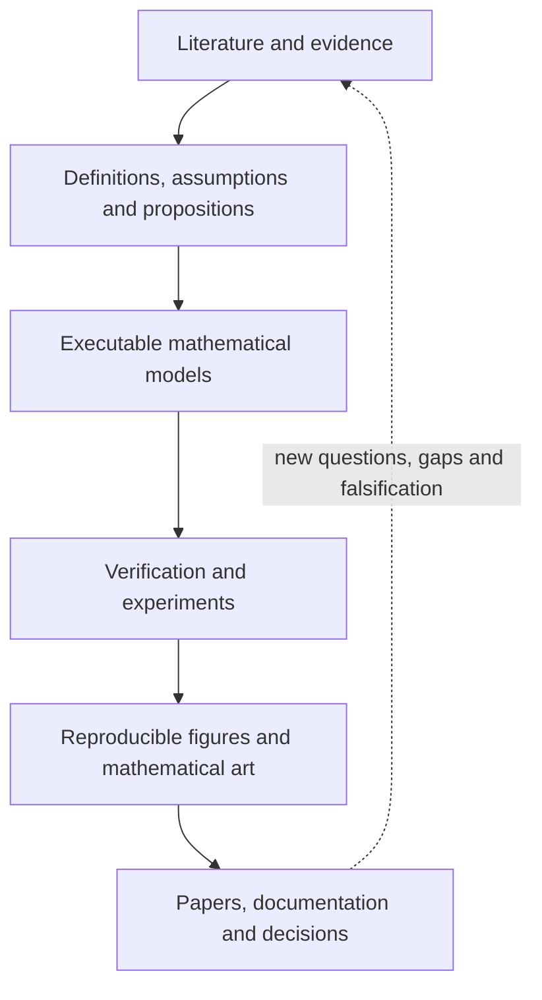

# Mathematics Exploration for Sustainable Resilience

## Differential Geometry and Mathematical Art for Sustainability and Resilience

[](https://github.com/Dossiya-SE/Differential-geometry-and-Mathematics-arts-for-sustainability-and-resilience/actions/workflows/ci.yml)
[](https://github.com/Dossiya-SE/Differential-geometry-and-Mathematics-arts-for-sustainability-and-resilience/actions/workflows/docs.yml)

This repository is a domain-neutral research platform for investigating how differential geometry, dynamical systems, sustainability mathematics, resilience theory, and mathematical art can be connected without confusing analogy with evidence.

> **Traceability rule:** every substantive claim connects to evidence; every mathematical object connects to a specification; every computation connects to tests; every figure connects to reproducible data and declared visual encodings.

## Governing status

| Field | Current state |
|---|---|
| Release | `0.4.0` — Research Platform Foundation |
| Research phase | Phase 0 scope mapping and architecture validation |
| Application domain | `NOT_SELECTED` |
| System boundary | `NOT_SELECTED` |
| Hazard or stressor | `NOT_SELECTED` |
| Demonstrator | `NOT_SELECTED` |
| Chain architecture | `MSR-CA-001`, `PROPOSED_NON_EXHAUSTIVE` |
| Scientific lifecycle | `MSR-RA-002`, `PROPOSED_ACTIVE_REVIEW` |

Coupled Power-Water-Transportation-Solid-Waste infrastructure under urban flooding remains one incomplete candidate. It has no privileged role in the core software, mathematical contracts, or selection process.

## Research architecture

The compact executive architecture is:



This six-node view is intentionally compressed. The authoritative end-to-end workflow is [`MSR-RA-002 — Scientific Research Lifecycle`](docs/SCIENTIFIC_RESEARCH_LIFECYCLE.md), rendered natively with Mermaid and covering primary-source acquisition, independent focal-paper reconstruction, equation-to-code traceability, reproduction, stress testing, independent validation, cross-paper mathematical synthesis, sustainable-resilience transfer falsification, mathematical art, publication, and feedback to new evidence.

The layers are linked by identifiers, citations, schemas, tests, checksums, and provenance records. Passing through the diagram does not upgrade an `INFERRED` or `PROPOSED` statement to `OBSERVED` or `VALIDATED`.

## Repository map

| Area | Responsibility |
|---|---|
| [`literature_review/`](literature_review/) | Search protocols, evidence matrices, case studies, citations, and application selection |
| [`mathematics/`](mathematics/) | Notation, definitions, assumptions, derivations, propositions, and model contracts |
| [`src/msr/`](src/msr/) | Domain-neutral reference implementations |
| [`tests/`](tests/) | Unit, property, numerical, regression, and future cross-language tests |
| [`experiments/`](experiments/) | Registered configurations, benchmarks, and reproducible experiment records |
| [`schemas/`](schemas/) | Machine-readable validation contracts |
| [`art/`](art/) | Mathematical-art encoding standard and exact visual sources |
| [`figures/`](figures/) | Source, generated, and publication-ready figures with provenance |
| [`docs/`](docs/) | Quarto research documentation, `MSR-RA-001`, `MSR-RA-002`, and architectural decisions |
| [`reproducibility/`](reproducibility/) | Environments, containers, and integrity manifests |
| [`.github/`](.github/) | Review templates, dependency policy, and automated quality gates |

The platform foundation is specified in [`docs/REPOSITORY_ARCHITECTURE.md`](docs/REPOSITORY_ARCHITECTURE.md). The full scientific workflow is specified in [`docs/SCIENTIFIC_RESEARCH_LIFECYCLE.md`](docs/SCIENTIFIC_RESEARCH_LIFECYCLE.md).

The mathematics-publication controls are demonstrated with an immutable mixed-surface fixture, retained audit evidence, explicit limitations, and reproducible hashes in the [`end-to-end mathematics-surface audit`](docs/audits/math-surfaces/END_TO_END_DEMO.md).

## Scientific boundaries

1. Mathematical beauty is not empirical validation.
2. Optimization is a method, not proof of implementability or benefit.
3. A recovery trajectory is not automatically a resilience measure.
4. Lower mass, lower cost, or sector relevance is not a sustainability assessment.
5. Aggregate service performance is not evidence of equitable population outcomes.
6. Evidence for one link does not establish an entire chain or its endpoint.
7. Exact mathematical graphics and interpretive artwork have different validation requirements.

These controls extend the non-conflation rules in [`literature_review/protocol/CHAIN_ARCHITECTURE.md`](literature_review/protocol/CHAIN_ARCHITECTURE.md).

## Quick start

Python 3.11 or later is required for the reference package.

```bash
python3 -m venv .venv
source .venv/bin/activate
python -m pip install -e '.[dev]'
make verify
```

Run the first domain-neutral reference experiment:

```bash
make experiment
```

The experiment tests geodesic exponential/logarithmic-map consistency on the unit two-sphere. It is a mathematical verification fixture, not an application-domain result.

## Evidence-first literature review

The current evidence base includes a 12-family, 60-subscope application landscape and the first focal-paper case study:

| Artifact | Purpose |
|---|---|
| [Phase-0 scope review](literature_review/application_selection/scope_review_01/SCOPE_REVIEW_01.md) | Cross-domain synthesis and bounded decision implications |
| [Application-selection protocol](literature_review/protocol/APPLICATION_DOMAIN_SELECTION.md) | Non-compensatory gates and comparative selection rules |
| [Decision status](literature_review/application_selection/DECISION_STATUS.yaml) | Authoritative machine-readable `NOT_SELECTED` state |
| [Ten-chain architecture](literature_review/protocol/CHAIN_ARCHITECTURE.md) | Provisional domain-neutral extraction and synthesis architecture |
| [Primary evidence bundle](literature_review/protocol/PRIMARY_EVIDENCE_BUNDLE.md) | Artifact provenance, inventory closure, execution, reproduction, validation, and copyright controls |
| [Scientific research lifecycle](docs/SCIENTIFIC_RESEARCH_LIFECYCLE.md) | Seven-phase gated workflow from source acquisition through sustainable-resilience transfer and publication |
| [Case Study MSR-CS-001](literature_review/case_studies/MSR-CS-001_design-for-descent/CASE_STUDY_01.md) | Main paper reviewed; artifact inventory, execution, and reproduction remain open |

Author–date citations are required for scholarly claims. Internal evidence identifiers remain secondary audit links and never replace academic attribution.

Case-study completion is staged as `MAIN_PAPER_REVIEWED`, `ARTIFACT_INVENTORY_CLOSED`, `EXECUTION_COMPLETE`, `PARTIALLY_REPRODUCED`, `REPRODUCED`, and `INDEPENDENTLY_VALIDATED`. A later stage must not be inferred from an earlier one.

## Contributing and review

Changes should be proposed through a branch and pull request. Contributors must declare evidence status, mathematical assumptions, tests, figure provenance, and any effect on application selection. See [`CONTRIBUTING.md`](CONTRIBUTING.md), [`GOVERNANCE.md`](GOVERNANCE.md), and [`docs/RESEARCH_INTEGRITY.md`](docs/RESEARCH_INTEGRITY.md).

## Citation and reuse

Use [`CITATION.cff`](CITATION.cff) to cite this research platform and cite every underlying scholarly source directly. Reuse permissions have not yet been granted for all repository components; consult [`LICENSES/README.md`](LICENSES/README.md) before reuse.
