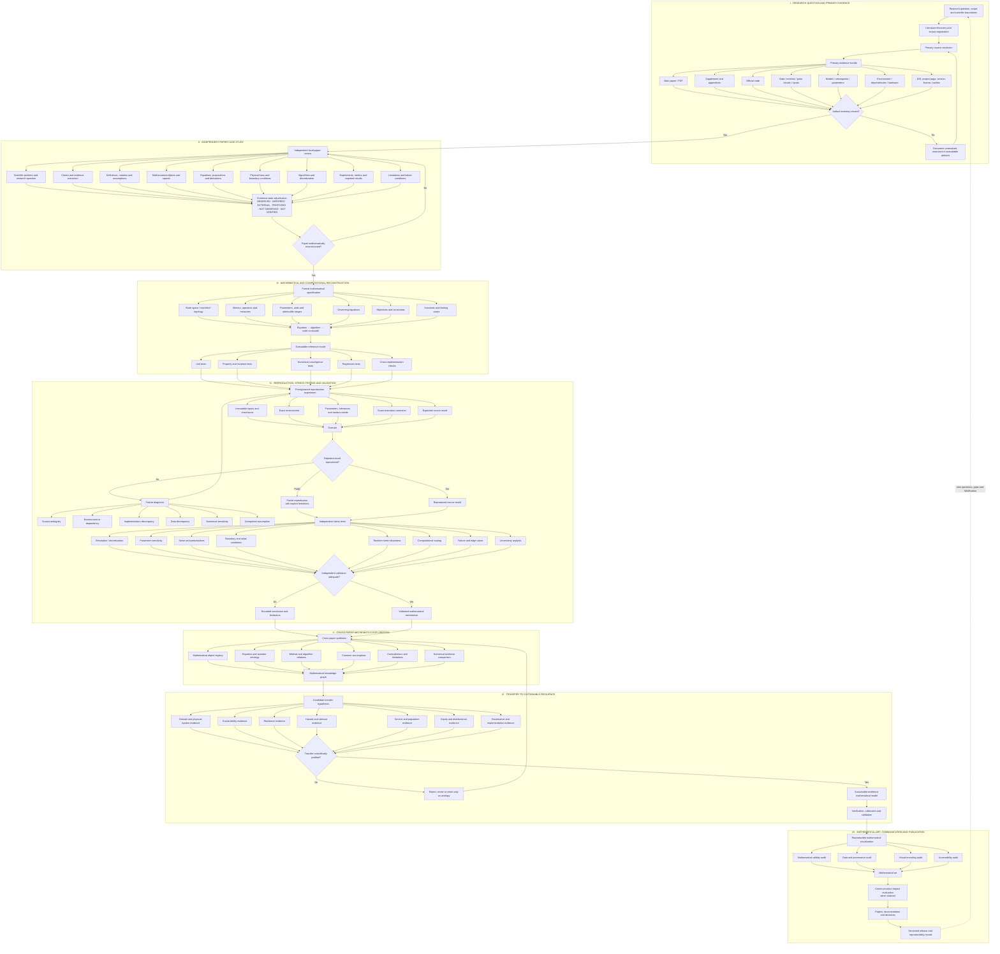

# MSR Scientific Research Lifecycle

- Architecture ID: `MSR-RA-002`
- Version: `0.1.0`
- Date: 2026-08-22
- Status: `PROPOSED_ACTIVE_REVIEW`
- Parent architecture: [`MSR-RA-001`](REPOSITORY_ARCHITECTURE.md)
- Application decision: `NOT_SELECTED`

## 1. Purpose

`MSR-RA-002` expands the repository's six-node executive architecture into the full scientific lifecycle used for focal-paper review, mathematical reconstruction, computational reproduction, cross-paper synthesis, sustainable-resilience transfer, mathematical visualization, and publication.

The lifecycle is deliberately **not a one-way pipeline**. It contains explicit gates, failure loops, transfer falsification, and a final return from released results to new questions and evidence.

The governing distinctions are:

- evidence acquisition is not evidence interpretation;
- author mathematics is not project mathematics;
- code availability is not execution;
- execution is not reproduction;
- reproduction is not independent validation;
- mathematical relevance is not sustainable-resilience relevance;
- mathematical art is not empirical validation;
- publication is not the endpoint of inquiry.

## 2. Authoritative Mermaid diagram

The standalone Mermaid source is maintained at [`diagrams/MSR_RA_002_SCIENTIFIC_RESEARCH_LIFECYCLE.mmd`](diagrams/MSR_RA_002_SCIENTIFIC_RESEARCH_LIFECYCLE.mmd).

## 3. Lifecycle phases

| Phase | Scientific purpose | Principal gate |
|---|---|---|
| I | Resolve corpus and all claim-critical primary artifacts | `Artifact inventory closed?` |
| II | Reconstruct each focal publication independently | `Paper mathematically reconstructed?` |
| III | Translate accepted mathematics into explicit specifications and code | Tests and equation-to-code traceability |
| IV | Reproduce source results, diagnose failures, stress-test, and independently validate | `Reported result reproduced?` and `Independent validation adequate?` |
| V | Link independently reviewed papers through mathematical objects, equations, methods, assumptions, contradictions, and numerical evidence | Knowledge-graph traceability |
| VI | Test whether mathematical mechanisms can be transferred to sustainable resilience using independent domain evidence | `Transfer scientifically justified?` |
| VII | Produce mathematically valid, provenance-controlled visualization and publication artifacts | Visual and publication audits |

## 4. Case-study rule

For every focal paper `MSR-CS-NNN`, the default path is:

$$
\text{source acquisition}
\rightarrow
\text{independent reconstruction}
\rightarrow
\text{equation-to-code traceability}
\rightarrow
\text{registered reproduction}
\rightarrow
\text{stress test}
\rightarrow
\text{bounded conclusion}.
$$

Cross-paper synthesis is downstream of individual judgement. A paper is not interpreted as a sustainable-resilience contribution merely because its mathematics appears transferable.

## 5. Primary-evidence dependency

Phase I is governed by [`PRIMARY_EVIDENCE_BUNDLE.md`](../literature_review/protocol/PRIMARY_EVIDENCE_BUNDLE.md). Required artifact classes are resolved per claim and experiment, including where applicable:

- main paper;
- supplementary material and appendices;
- official code;
- datasets, meshes, point clouds, simulation inputs, or procedural generators;
- models and checkpoints;
- environment and dependency information;
- DOI, project page, immutable version, license, and hashes.

A missing artifact does not automatically fail the review. It must receive an admissible documented lifecycle state and its effect on attainable reproduction status must remain explicit.

## 6. Evidence-state firewall

Scientific evidence status and artifact/reproduction status remain orthogonal. In particular:

$$
\texttt{REPRODUCED}
\not\Rightarrow
\texttt{VALIDATED},
$$

and

$$
\texttt{PROPOSED}
\not\Rightarrow
\texttt{OBSERVED}
$$

merely because a proposed extension has been implemented in code.

## 7. Cross-paper synthesis contract

Only reviewed case studies enter Phase V. Cross-paper edges must identify the relation type and source evidence. Typical relation classes include:

- shared mathematical object;
- operator dependence;
- discretization or approximation relation;
- algorithmic extension;
- shared assumption;
- contradictory result or boundary condition;
- common benchmark;
- implementation dependence;
- validated transfer candidate.

The knowledge graph must preserve directionality and must not treat co-citation, topical similarity, or visual resemblance as mathematical dependence.

## 8. Sustainable-resilience transfer firewall

A mathematical mechanism moves from Phase V to a sustainable-resilience model only after independent evidence supports the intended physical and decision interpretation. Candidate transfer requires, as applicable, domain evidence, physical-system evidence, sustainability evidence, resilience evidence, hazard/stressor evidence, service/population evidence, equity evidence, and implementation/governance evidence.

Failed transfer is a scientific result. It returns to cross-paper synthesis as a rejected, revised, or analogy-only relation rather than being silently removed.

## 9. Mathematical-art firewall

A figure or artwork is downstream of a declared mathematical object, dataset, experiment, or evidence record. Four audits are explicit before publication:

1. mathematical validity;
2. data and provenance;
3. visual encoding;
4. accessibility.

Communication impact is assessed separately and only when such an effect is claimed.

## 10. Feedback and falsification loop

The release node returns to the research-question node because every completed study may create:

- new falsification tests;
- unresolved mathematical questions;
- missing evidence requirements;
- contradictory cases;
- domain-transfer failures;
- new candidate methods;
- revisions to assumptions, tolerances, or model boundaries.

The authoritative conceptual loop is therefore

$$
\mathcal E
\rightarrow
\mathcal M
\rightarrow
\mathcal C
\rightarrow
\mathcal R
\rightarrow
\mathcal S
\rightarrow
\mathcal T
\rightarrow
\mathcal P
\circlearrowleft,
$$

where evidence, mathematics, computation, reproduction, synthesis, transfer, and publication remain separately auditable stages.