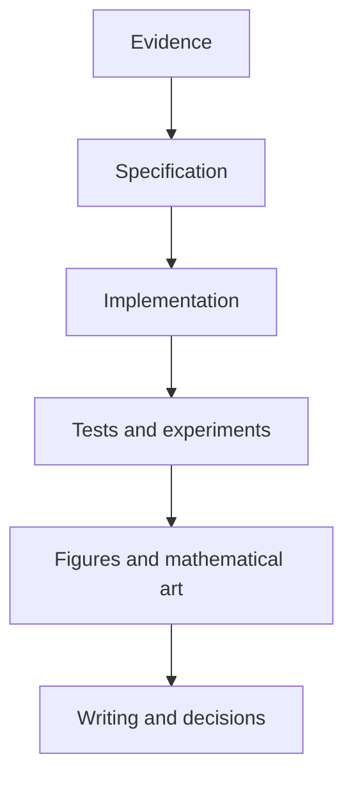

The research platform is organized by epistemic responsibility rather than by a presumed application domain.

## Layer controls

| Layer | Required inputs | Required outputs | Prohibited shortcut |
|---|---|---|---|
| Evidence | Checked sources and search records | Cited claims and evidence states | Audit IDs used instead of citations |
| Specification | Definitions, assumptions, domains, units | Versioned model contract | Equation without applicability conditions |
| Implementation | Model contract and numerical choices | Typed reusable functions | Notebook-only production logic |
| Verification | Invariants, benchmarks, tolerances | Tests and experiment records | One successful example treated as validation |
| Mathematical art | Mathematical object and encoding map | Source artifact, provenance, accessibility | Aesthetic quality treated as scientific evidence |
| Publication | Traceable outputs and limitations | HTML, PDF, releases, decision records | Interpretation presented as observation |

The full normative specification is maintained in `docs/REPOSITORY_ARCHITECTURE.md`.
