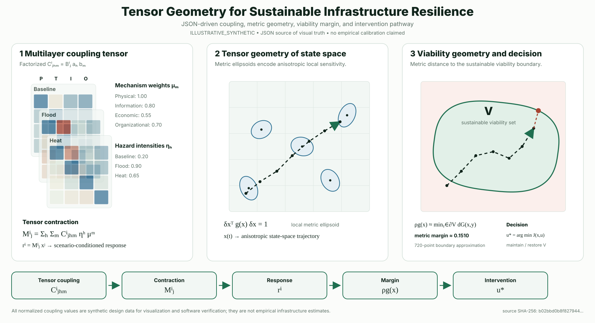

The gallery separates mathematically verified fixtures from synthetic visual demonstrators. Every figure keeps an explicit provenance and interpretation boundary.

## MSR-FIG-0001 — spherical geodesic verification

{fig-alt="A unit sphere shown as a circle, with a great-circle geodesic and two labeled endpoints. The graphic is a mathematical verification illustration, not an empirical sustainability result."}

This vector artifact is associated with model `MSR-MOD-0001` and experiment `MSR-EXP-0001`.

## MSR-FIG-0002 — JSON-driven tensor geometry

{fig-alt="Three-panel mathematical visual showing synthetic multilayer coupling tensor slices, metric ellipsoids along a state-space trajectory, and a viability boundary with a metric margin and intervention pathway."}

The tensor visual is generated from [`art/tensor-geometry/tensor_geometry.json`](../art/tensor-geometry/tensor_geometry.json) and has an [interactive inspection page](tensor-geometry.qmd). Its animated SVG, provenance record and interactive browser view all derive from the same machine-readable specification.

## Interpretation boundary

`MSR-FIG-0001` demonstrates a visual encoding of an exact mathematical fixture. `MSR-FIG-0002` is `ILLUSTRATIVE_SYNTHETIC`: its normalized coupling values are design data for mathematical visualization and software verification, not empirical infrastructure estimates or evidence that an application domain has been selected.
