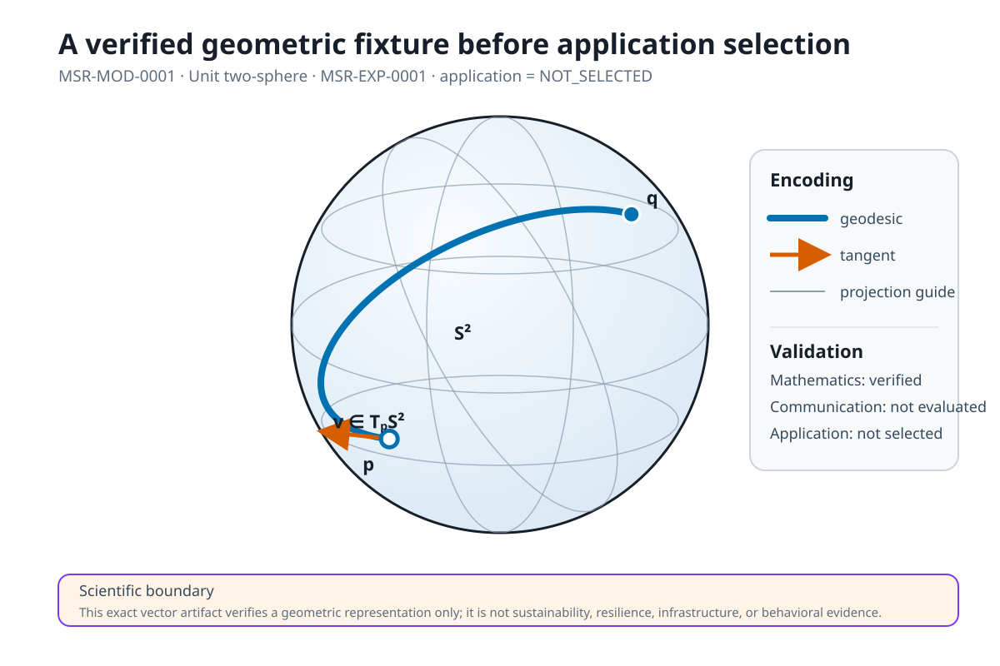

The gallery is under foundation development. Its first exact artifact is a vector construction of a spherical geodesic associated with model `MSR-MOD-0001` and experiment `MSR-EXP-0001`.

{fig-alt="A unit sphere shown as a circle, with a great-circle geodesic and two labeled endpoints. The graphic is a mathematical verification illustration, not an empirical sustainability result."}

## Interpretation boundary

The figure demonstrates a visual encoding of an exact mathematical fixture. It does not demonstrate resilience, sustainability, behavioral impact, or application suitability.
